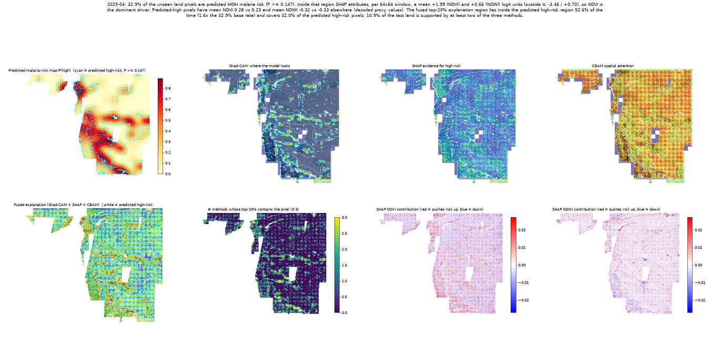
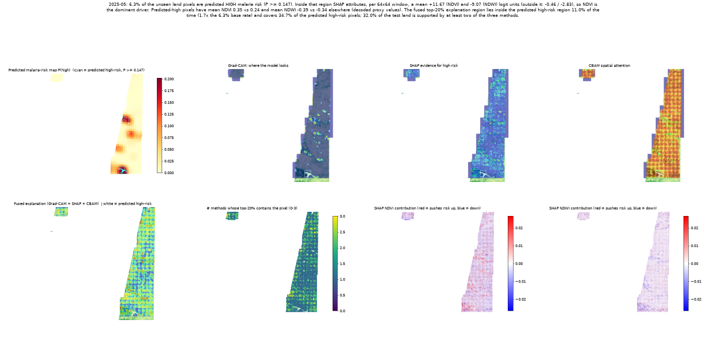
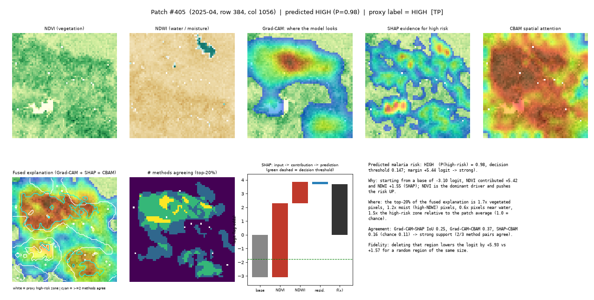
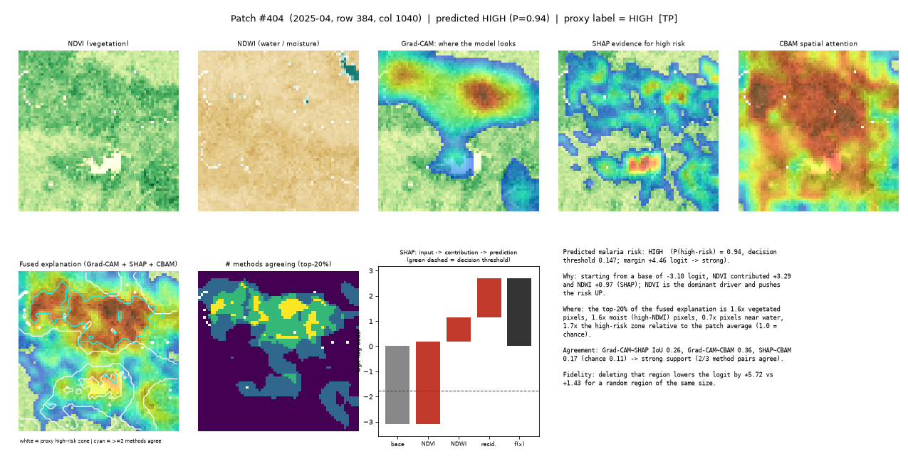
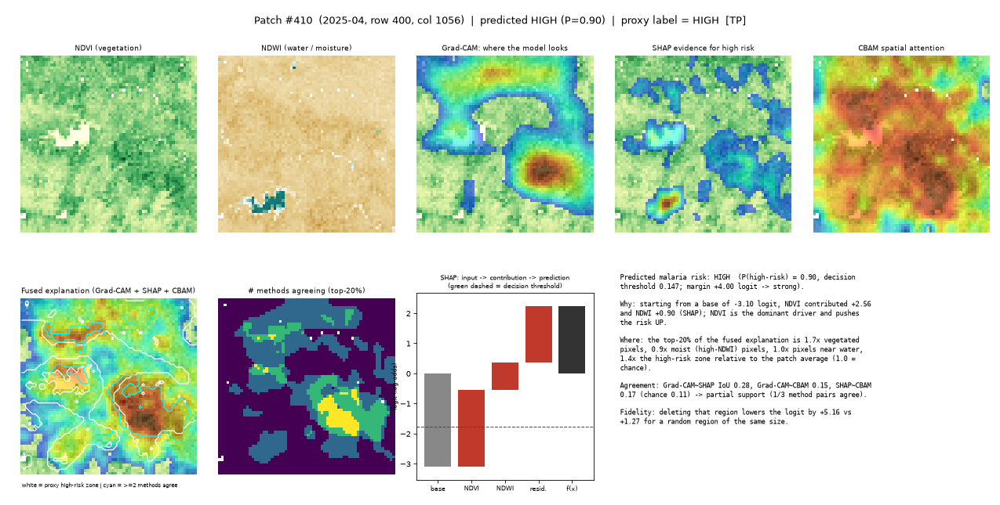
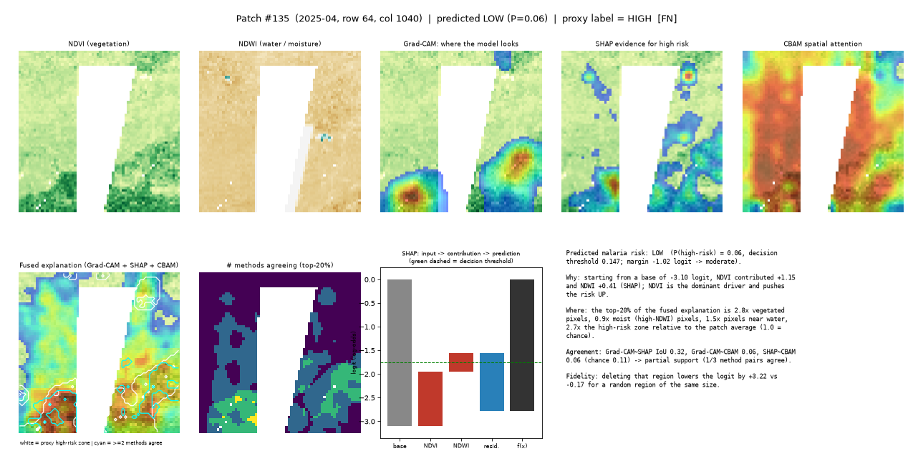
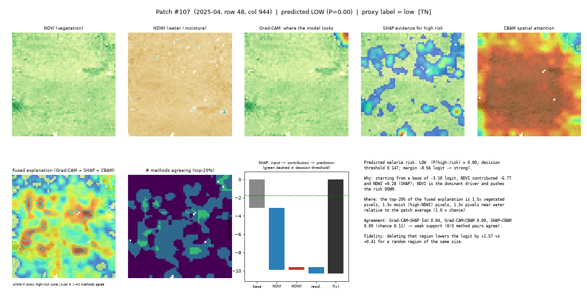
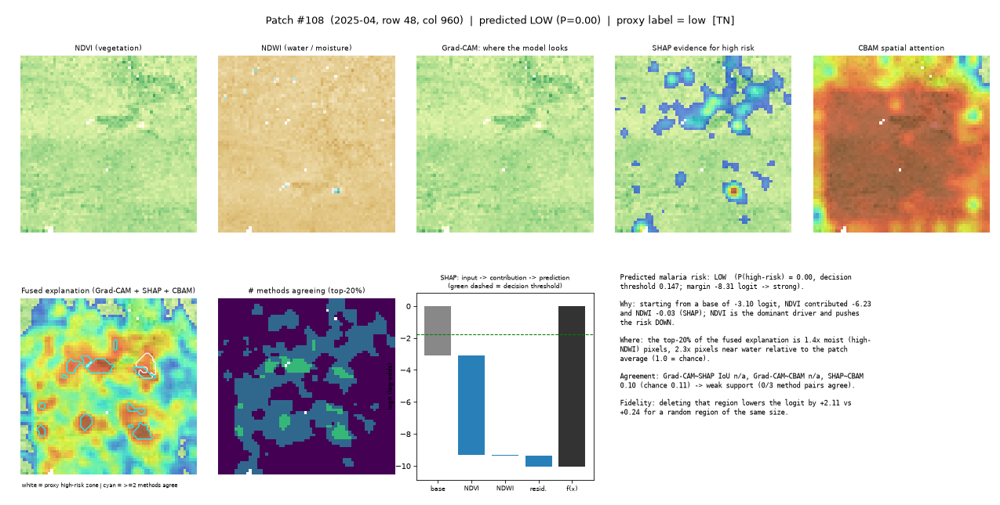

# Final explainable output (Step 8)

Fusion shown: **Grad-CAM + SHAP + CBAM**. Decision threshold P(high-risk) >= 0.147.

## 1. What the system returns

| Component | Source |
|---|---|
| Predicted malaria-risk level, P(high-risk), decision margin | Step 3 model |
| Risk heatmap + predicted high-risk region overlay | Step 3 scene probabilities |
| Grad-CAM explanation (where the model looks) | Step 4 |
| SHAP feature contributions (NDVI, NDWI; signed, logit units) | Step 5 |
| CBAM spatial attention map | Step 6 |
| Fused explanation, #methods agreeing, support level, deletion fidelity | Step 7 |
| Plain-language explanation | generated from the numbers above |

## 2. Prediction performance vs explanation quality (kept separate)

- Prediction (unseen test blocks): patch precision 0.61, recall 0.57, F1 0.59, AUC 0.84; pixel IoU 0.25 (precision 0.39, recall 0.41). The XAI layer does not change these.
- Spatial agreement (predicted-high test patches, mean top-20% IoU; chance 0.11): gradcam~shap 0.34, gradcam~cbam 0.15, shap~cbam 0.15.
- Stability under 0.05x-sd input noise (top-20% IoU, clean vs noisy): Grad-CAM 0.92, SHAP 0.72 (its own Monte-Carlo noise floor 0.55), CBAM 0.78, fused 0.79.
- Fidelity (deleting each method's top pixels, predicted-high test patches, mean logit drop over 5-50% deleted; random-pixel baseline 1.86): gradcam 5.19, shap 6.61, cbam 3.06, fused_gc_shap 6.38, fused_all3 5.86.

## 3. Scene-level explanations

### 2025-04

2025-04: 32.9% of the unseen land pixels are predicted HIGH malaria risk (P >= 0.147). Inside that region SHAP attributes, per 64x64 window, a mean +1.99 (NDVI) and +0.66 (NDWI) logit units (outside it: -3.46 / +0.70), so NDVI is the dominant driver. Predicted-high pixels have mean NDVI 0.28 vs 0.23 and mean NDWI -0.32 vs -0.33 elsewhere (decoded proxy values). The fused top-20% explanation region lies inside the predicted high-risk region 52.6% of the time (1.6x the 32.9% base rate) and covers 32.0% of the predicted high-risk pixels; 10.9% of the test land is supported by at least two of the three methods.



GeoTIFF for QGIS: `step8_final_2025-04.tif`

### 2025-05

2025-05: 6.3% of the unseen land pixels are predicted HIGH malaria risk (P >= 0.147). Inside that region SHAP attributes, per 64x64 window, a mean +11.67 (NDVI) and -9.07 (NDWI) logit units (outside it: -0.46 / -2.83), so NDVI is the dominant driver. Predicted-high pixels have mean NDVI 0.35 vs 0.24 and mean NDWI -0.39 vs -0.34 elsewhere (decoded proxy values). The fused top-20% explanation region lies inside the predicted high-risk region 11.0% of the time (1.7x the 6.3% base rate) and covers 34.7% of the predicted high-risk pixels; 32.0% of the test land is supported by at least two of the three methods.



GeoTIFF for QGIS: `step8_final_2025-05.tif`

## 4. Example patch explanations (unseen test blocks)

### Patch #405 [TP] - 2025-04

```
Predicted malaria risk: HIGH  (P(high-risk) = 0.98, decision threshold 0.147; margin +5.44 logit -> strong).
Why: starting from a base of -3.10 logit, NDVI contributed +5.42 and NDWI +1.55 (SHAP); NDVI is the dominant driver and pushes the risk UP.
Where: the top-20% of the fused explanation is 1.7x vegetated pixels, 1.2x moist (high-NDWI) pixels, 0.6x pixels near water, 1.5x the high-risk zone relative to the patch average (1.0 = chance).
Agreement: Grad-CAM~SHAP IoU 0.25, Grad-CAM~CBAM 0.37, SHAP~CBAM 0.16 (chance 0.11) -> strong support (2/3 method pairs agree).
Fidelity: deleting that region lowers the logit by +5.93 vs +1.57 for a random region of the same size.
```



### Patch #404 [TP] - 2025-04

```
Predicted malaria risk: HIGH  (P(high-risk) = 0.94, decision threshold 0.147; margin +4.46 logit -> strong).
Why: starting from a base of -3.10 logit, NDVI contributed +3.29 and NDWI +0.97 (SHAP); NDVI is the dominant driver and pushes the risk UP.
Where: the top-20% of the fused explanation is 1.6x vegetated pixels, 1.6x moist (high-NDWI) pixels, 0.7x pixels near water, 1.7x the high-risk zone relative to the patch average (1.0 = chance).
Agreement: Grad-CAM~SHAP IoU 0.26, Grad-CAM~CBAM 0.36, SHAP~CBAM 0.17 (chance 0.11) -> strong support (2/3 method pairs agree).
Fidelity: deleting that region lowers the logit by +5.72 vs +1.43 for a random region of the same size.
```



### Patch #410 [TP] - 2025-04

```
Predicted malaria risk: HIGH  (P(high-risk) = 0.90, decision threshold 0.147; margin +4.00 logit -> strong).
Why: starting from a base of -3.10 logit, NDVI contributed +2.56 and NDWI +0.90 (SHAP); NDVI is the dominant driver and pushes the risk UP.
Where: the top-20% of the fused explanation is 1.7x vegetated pixels, 0.9x moist (high-NDWI) pixels, 1.0x pixels near water, 1.4x the high-risk zone relative to the patch average (1.0 = chance).
Agreement: Grad-CAM~SHAP IoU 0.28, Grad-CAM~CBAM 0.15, SHAP~CBAM 0.17 (chance 0.11) -> partial support (1/3 method pairs agree).
Fidelity: deleting that region lowers the logit by +5.16 vs +1.27 for a random region of the same size.
```



### Patch #135 [FN] - 2025-04

```
Predicted malaria risk: LOW  (P(high-risk) = 0.06, decision threshold 0.147; margin -1.02 logit -> moderate).
Why: starting from a base of -3.10 logit, NDVI contributed +1.15 and NDWI +0.41 (SHAP); NDVI is the dominant driver and pushes the risk UP.
Where: the top-20% of the fused explanation is 2.8x vegetated pixels, 0.9x moist (high-NDWI) pixels, 1.5x pixels near water, 2.7x the high-risk zone relative to the patch average (1.0 = chance).
Agreement: Grad-CAM~SHAP IoU 0.32, Grad-CAM~CBAM 0.06, SHAP~CBAM 0.06 (chance 0.11) -> partial support (1/3 method pairs agree).
Fidelity: deleting that region lowers the logit by +3.22 vs -0.17 for a random region of the same size.
```



### Patch #107 [TN] - 2025-04

```
Predicted malaria risk: LOW  (P(high-risk) = 0.00, decision threshold 0.147; margin -8.56 logit -> strong).
Why: starting from a base of -3.10 logit, NDVI contributed -6.77 and NDWI +0.28 (SHAP); NDVI is the dominant driver and pushes the risk DOWN.
Where: the top-20% of the fused explanation is 1.5x vegetated pixels, 1.3x moist (high-NDWI) pixels, 1.3x pixels near water relative to the patch average (1.0 = chance).
Agreement: Grad-CAM~SHAP IoU 0.04, Grad-CAM~CBAM 0.00, SHAP~CBAM 0.09 (chance 0.11) -> weak support (0/3 method pairs agree).
Fidelity: deleting that region lowers the logit by +1.57 vs +0.41 for a random region of the same size.
```



### Patch #108 [TN] - 2025-04

```
Predicted malaria risk: LOW  (P(high-risk) = 0.00, decision threshold 0.147; margin -8.31 logit -> strong).
Why: starting from a base of -3.10 logit, NDVI contributed -6.23 and NDWI -0.03 (SHAP); NDVI is the dominant driver and pushes the risk DOWN.
Where: the top-20% of the fused explanation is 1.4x moist (high-NDWI) pixels, 2.3x pixels near water relative to the patch average (1.0 = chance).
Agreement: Grad-CAM~SHAP IoU n/a, Grad-CAM~CBAM n/a, SHAP~CBAM 0.10 (chance 0.11) -> weak support (0/3 method pairs agree).
Fidelity: deleting that region lowers the logit by +2.11 vs +0.24 for a random region of the same size.
```



## 5. Caveats

- Risk labels are PROXY labels built in Step 2 (distance-to-water, moisture and vegetation), not observed malaria cases: the explanations show what the model uses to reproduce that proxy.
- NDVI / NDWI are decoded from colour-rendered GeoTIFFs (decode.py): values are an ordered proxy, not calibrated indices.
- Only two months (2025-04, 2025-05) and one region are available; test blocks are few, so per-method differences should be read as indicative.
- The SHAP evidence map is computed from input gradients of the same logit that the deletion test perturbs, so it is favoured by that test; Grad-CAM and CBAM operate on a coarse 16x16 feature grid. CBAM attention is a learned gate, not an attribution of the output, and agrees only weakly with Grad-CAM, so it adds the least to the fusion.
